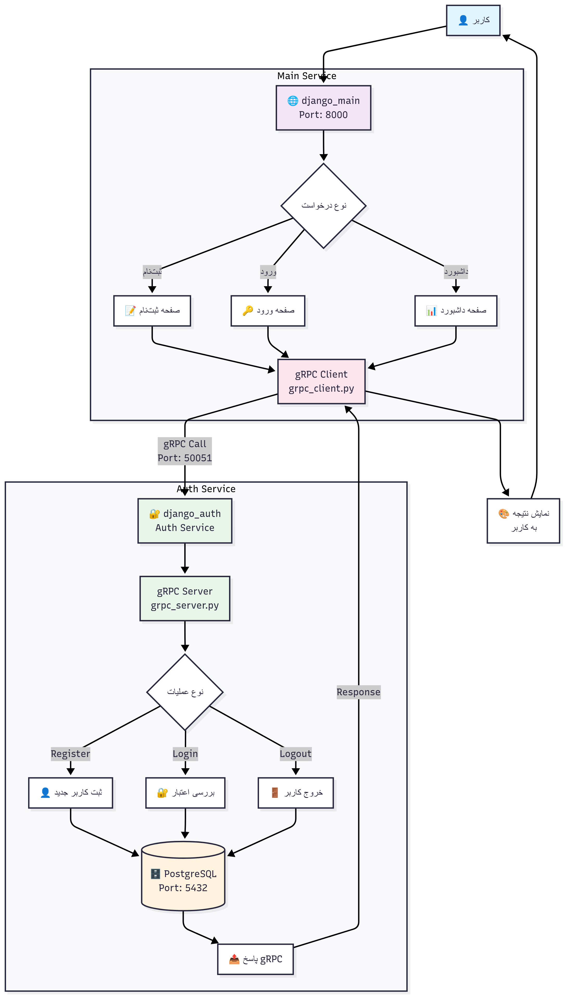

# میکروسرویس احراز هویت با Django و gRPC

## معرفی پروژه

این پروژه شامل دو سرویس مجزا است که با استفاده از gRPC با یکدیگر ارتباط برقرار می‌کنند:

### 🔐 سرویس احراز هویت (django_auth)
- مسئول ثبت‌نام، ورود و خروج کاربران
- دارای سرور gRPC که روی پورت 50051 اجرا می‌شود
- از پایگاه داده PostgreSQL استفاده می‌کند

### 🌐 سرویس اصلی (django_main)  
- رابط کاربری وب
- درخواست‌های احراز هویت را از طریق gRPC به سرویس auth ارسال می‌کند
- شامل صفحات ثبت‌نام، ورود و داشبورد

## نحوه اجرا

### روش آسان (استفاده از فایل Batch)
```bash
# فقط این فایل را اجرا کنید
build_services.bat
```

### روش دستی
```bash
# 1. بیلد کردن سرویس احراز هویت
cd django_auth
docker-compose build
docker-compose up -d

# 2. بیلد کردن سرویس اصلی
cd ../django_main
docker-compose build
docker-compose up
```

## معماری سیستم

```
کاربر → django_main (وب اپلیکیشن) → gRPC → django_auth (سرویس احراز هویت)
```

- **احراز هویت**: در سرویس `django_auth` انجام می‌شود
- **رابط کاربری**: در سرویس `django_main` قرار دارد
- **ارتباط**: از طریق gRPC برقرار می‌شود

## 🔄 فلوی عملیاتی سیستم



### 📋 توضیح فلوی کاری:

1. **🌐 ورودی کاربر**: کاربر از طریق مرورگر به سرویس اصلی (`django_main`) متصل می‌شود
2. **🎯 تشخیص درخواست**: سیستم نوع درخواست (ثبت‌نام، ورود، داشبورد) را تشخیص می‌دهد
3. **📡 ارسال gRPC**: درخواست از طریق کلاینت gRPC به سرویس احراز هویت ارسال می‌شود
4. **⚙️ پردازش در Auth**: سرور gRPC درخواست را پردازش و با پایگاه داده ارتباط برقرار می‌کند
5. **📤 بازگشت پاسخ**: نتیجه از طریق gRPC به سرویس اصلی بازگردانده می‌شود
6. **🎨 نمایش نتیجه**: نتیجه نهایی به کاربر نمایش داده می‌شود

## پورت‌ها

- **django_auth**: 8001 (وب) + 50051 (gRPC)
- **django_main**: 8000 (وب)
- **PostgreSQL**: 5432

## فایل‌های مهم

- `django_auth/grpc/grpc_server.py`: سرور gRPC
- `django_main/grpc/grpc_client.py`: کلاینت gRPC
- `django_main/main_app/views.py`: منطق ارتباط با سرویس auth

## نکات مهم

- سرویس `django_auth` باید قبل از `django_main` اجرا شود
- هر دو سرویس در شبکه `microservice-network` قرار دارند
- کلاینت gRPC به صورت خودکار در Django views فراخوانی می‌شود

# future

## in future we will add and change this repo better example

## like rest, grpc, graph and other ways 
